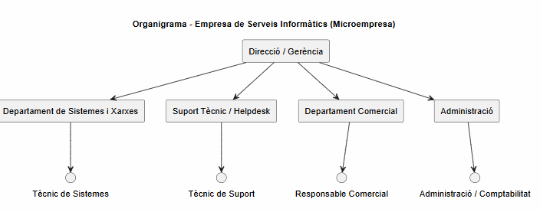

# T01: Coneixent la competència i el sector

## Recerca de mercat:

### **1. Digitalnet**

Web: digitalnet.cat
Adreça: Via Europa 171, 08303 Mataró
Telèfon: 930 092 500

**Serveis destacats:**

Manteniment informàtic, suport tècnic, xarxes i VPN, servidors, solucions cloud i impressió, entre d’altres.

**Plantilla:** 3 treballador.

**Mida:** Microempresa

### **1. DYD Serveis Informàtics**

Web: dydserveis.com

Telèfon: 93 757 75 80

Adreça: Carrer de Sant Cugat, 107 (Local 4), 08302 Mataró

**Serveis destacats:**

serveis informàtics a Mataró, manteniment informàtic, disseny web, estratègia digital, xarxes socials i posicionament

**Plantilla:** 5 treballadors

**Conclusió:** Microempresa

### **1. Alphanet Solutions**

Web: alphanet-solutions.com

Teléfono: +34 931 13 72 52

Dirección: C/ Pablo Iglesias, 54, 08302 Mataró (Barcelona)

**Serveis destacats:**

Solucions tecnològiques per a municipis i administracions públiques orientades a seguretat i mobilitat.

**Plantilla:** 30 treballadors .

**Mida:** PIME.

## Radiografia de departaments

**Direcció / Gerència**

És la persona que porta l’empresa. S’encarrega de prendre les decisions importants, organitzar la feina de l’equip, parlar amb els clients principals i assegurar-se que tot funcioni correctament. En moltes empreses petites, aquesta funció la fa el mateix propietari.

**Departament de Sistemes i Xarxes**

Aquest departament s’encarrega que els ordinadors i la connexió a internet dels clients funcionin bé. Instal·len equips, configuren les connexions i es preocupen perquè tot estigui en bon estat i no hi hagi problemes.

**Suport Tècnic / Helpdesk**

És el departament que ajuda els clients quan tenen algun problema amb els ordinadors. Atén trucades o missatges, resol errors i dona ajuda perquè els equips tornin a funcionar correctament. És el contacte més directe amb el client en el dia a dia.

**Departament Comercial**

S’encarrega de buscar nous clients i mantenir el contacte amb els que ja té l’empresa. Fa pressupostos, explica els serveis i ajuda a aconseguir més feina. En empreses petites, aquesta feina sovint la fa la mateixa persona que dirigeix l’empresa.

**Administració**

Aquest departament porta els temes de diners i papers. Fa les factures, controla els cobraments i pagaments i guarda la documentació de l’empresa. En moltes microempreses, aquesta feina la fa una sola persona o una empresa externa.

## Estratègia

La nostra estratègia es basa en oferir un servei proper i de confiança. Som una empresa local de Mataró, fet que ens permet donar una resposta ràpida i un tracte directe amb el client.

Ens diferenciem per la rapidesa en la resolució de problemes, l’atenció personalitzada i uns preus clars i competitius. L’objectiu és establir una relació a llarg termini amb FoodLogístic S.A. i garantir que els seus sistemes informàtics funcionin sempre correctament.

## Recursos necessaris

1 tècnic de sistemes i xarxes, encarregat de la configuració i manteniment dels equips i connexions.
1 tècnic de suport, que atengui les incidències diàries i doni assistència als usuaris.
1 responsable de l’empresa, que coordini el servei, tracti amb el client i gestioni els pressupostos.

Fet per:

Pau Guerrero i Vicenç Obiol                                                             