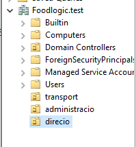
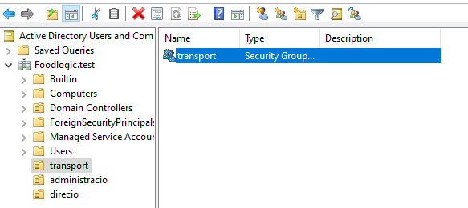
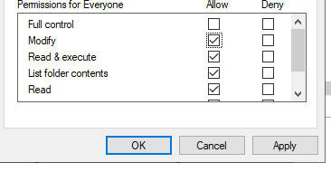
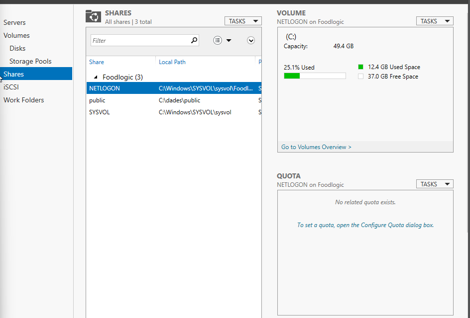
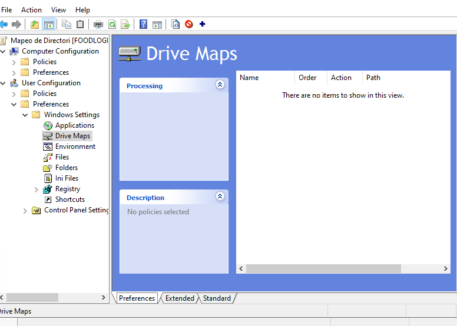
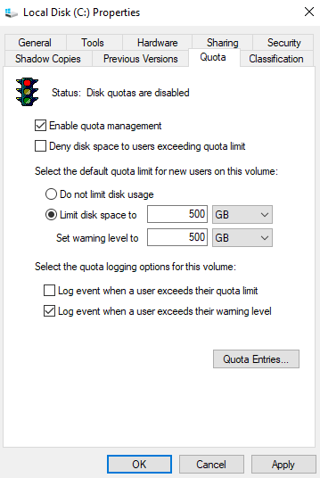
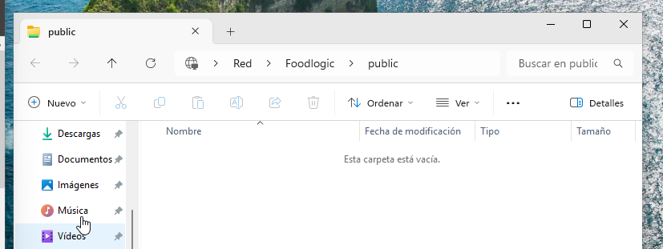
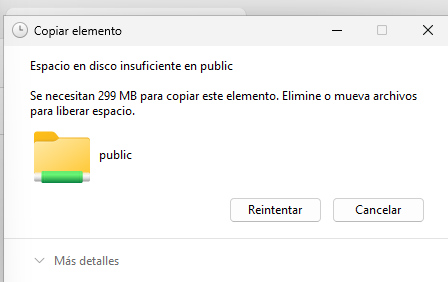

# Implementació Infraestructura de Fitxers – FoodLogistic

## 1. Preparació d’Active Directory

### 1.1 Crear estructura d’OUs
- A `Active Directory Users and Computers`, creeu OUs per departaments.
- Organitzeu usuaris segons l’àrea funcional.

### 1.2 Crear grups de seguretat
- Creeu grups de seguretat:
  - Administracio
  - Transport
  - Direccio
- Afegiu els usuaris corresponents a cada grup.

## 2. Recursos Compartits

### 2.1 Carpeta Public (Explorador)
- Creeu la carpeta `Public` al servidor.
- Compartiu-la amb SMB lectura i NTFS modificació.

### 2.2 Carpeta Operacions (Server Manager)
- Instal·leu el rol *File and Storage Services*.
- Creeu el recurs compartit amb ABE activat.
- Permetreu accés només al grup Transport.

📸 **Captura:** Configuració del recurs compartit amb ABE.

### 2.3 Carpeta Direccio (PowerShell avançat)
- Creeu la carpeta `Direccio`.
- Compartiu-la amb `New-SmbShare` i ABE habilitat.
- Accés exclusiu al grup Direccio.

### 2.4 Mapeig de la unitat Z:
- Creeu una GPO per mapar la carpeta Direccio com a Z:.
- Apliqueu la GPO només al grup Direccio.

## 3. Control d’Emmagatzematge

### 3.1 Quotes NTFS (Volum)
- Activeu quotes NTFS a la unitat de dades.
- Establiu límit per defecte de 500 MB.

### 3.2 FSRM – Quota Carpeta Public
- Instal·leu el rol *File Server Resource Manager*.
- Apliqueu Hard Quota de 200 MB amb avís al 90%.

📸 **Captura:** Política de quota i configuració de notificació.

### 3.3 FSRM – Filtrat de fitxers a Operacions
- Creeu un filtre que bloquegi `.exe`, `.msi`, àudio i vídeo.
- Apliqueu-lo a la carpeta Operacions.

## 4. Verificació des del Client

### 4.1 Prova d’accés
- Inicieu sessió amb un usuari de cada grup.
- Comproveu quines carpetes veu i pot accedir.

### 4.2 Prova de filtratge
- Intenteu copiar un `.exe` a Operacions.
- Proveu canviar l’extensió a `.txt`.

## 5. Conclusions
- Els permisos funcionen segons el grup.
- Les quotes i filtres limiten correctament l’ús del disc.

📸 **Captura opcional:** Taula resum o prova final.